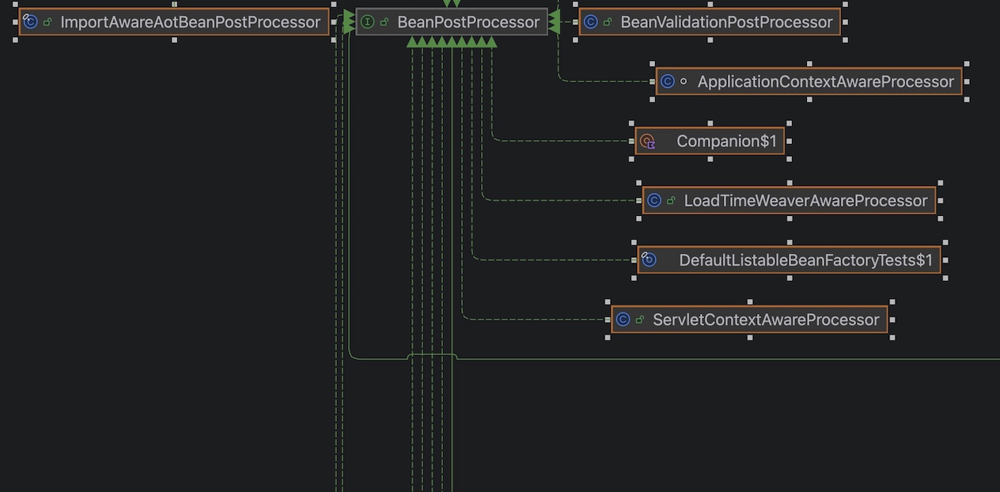

# spring IOC 源码理解

注：本文参考 spring版本6.2.10，各个大版本可能有一些细微区别，但大致原理相同
- 本文不准备贴大段的代码，那个并没有什么特别的意义，除非特别关键的。阅读框架的思想是抽象大于细节，找到最高层次的抽象，找到入口函数。理解思想。对于spring bean 的ioc容器，而且最后搜集到一个concurrenthashmap中去。主线就是bean的生命周期管理。从bean的搜集->初始化->成熟->销毁。这是一个相当简化的模型，结合了相当多的回调函数，但是核心还是继承了beanFactoryPostProcessor和beanPostProcessor这两个接口，甚至你会发现所谓的bean搜集，就是beanFactoryPostProcessor的子接口BeanDefinitionRegistryPostProcessor的做的，aop切面则是beanPostProcessor做的。
- spring beans这个包有着比较重要的几个抽象接口，下面依次说明。在阅读代码的时候建议之间查看uml图，重点查看继承关系，特别是这种框架代码很多模版方法，很多具体的细节在抽象类而不是具体实现类。

## spring IOC 

### 入口函数
spring的最重要的函数是AbstractApplicationContext的refresh函数，这里是一切的起点。建议阅读源码的时候从这里开始打断点，你可以一步一步进去看看是怎么做的。


### BeanFactory


Spring里面的默认BeanFactory是DefaultListableBeanFactory。
1. HierarchicalBeanFactory是实现bean工厂的父子结构，类似于classloader的双亲委派，实际上是聚合了父工厂，优先从本地查询（containsLocalBean），如果查询不到就会走getParentBeanFactory。但是这里其实有一个坑，就是如果你不同的beanfactory，比如tomcat（他其实是一个另外的abstractApplicationcontext）,那么你get的Bean不一定是你想要的那一个，因为优先从本地查询。重复的也不会报错在不同的beanFactory。
2. DefaultListableBeanFactory倒是可以多关注一下，因为这个是默认的beanFactory，所以你基本上比如getBean方法，createBean方法，你可以找到具体的实现，排查问题的时候也比较方便一些。
### PostProcessor系列 
这个并不是一个抽象接口，而是两个独立的抽象接口，被调用的时间段也不一样，但是都是属于回调的接口，所以我放在一起说。

#### BeanFactoryPostProcessor（BeanDefinition 的处理/扩展）


1. BeanFactoryPostProcessor(BFPP)最重要的核心方法就是postProcessBeanFactory，这是一个执行的钩子函数。这个接口在这里调用：ApplicationContext.refresh()方法的invokeBeanFactoryPostProcessors(beanFactory)中会执行。你当然也可以手动add进去，它也会在这里执行。比如
``` java
AnnotationConfigApplicationContext ctx = new AnnotationConfigApplicationContext();
ctx.addBeanFactoryPostProcessor(new MyBFPP());
ctx.refresh();
```
2. 在AbstractApplicationContext中，有一个属性beanFactoryPostProcessors，这个是存放需要执行的beanFactoryPostProcessors。
当然我们需要关注两个抽象点，这两个抽象点存在着继承关系，BFPP和BeanDefinitionRegistryPostProcessor。它额外提供了一个方法postProcessBeanDefinitionRegistry，它提供修改和新增beandefinition 的能力。BeanDefinitionRegistryPostProcessor最重要的一个实现类就是ConfigurationClassPostProcessor。那么你肯定会问它为什么能够保证在前面执行呢，源码是这样的：
``` java
List<BeanFactoryPostProcessor> regularPostProcessors = new ArrayList<>();
			List<BeanDefinitionRegistryPostProcessor> registryProcessors = new ArrayList<>();

			for (BeanFactoryPostProcessor postProcessor : beanFactoryPostProcessors) {
				if (postProcessor instanceof BeanDefinitionRegistryPostProcessor registryProcessor) {
					registryProcessor.postProcessBeanDefinitionRegistry(registry);
					registryProcessors.add(registryProcessor);
				}
				else {
					regularPostProcessors.add(postProcessor);
				}
			}
```
它在这里手动分成两拨，然后分次序执行。
##### ConfigurationClassPostProcessor
在我的url图中因为只呈现了beans这个包中的uml图，在别的包也有对应的实现，对于AnnotationConfigApplicationContext（它主要是注解驱动的bean管理上下文类)，在一大堆调用（构造函数调用一个AnnotatedBeanDefinitionReader），绕了一大圈，终于注册进去了ConfigurationClassPostProcessor ，它负责@Configuration、解析 @Bean、@ComponentScan（这个在ComponentScanAnnotationParser里面看具体的实现），动态往容器里加 BeanDefinition。（因为实现了BeanDefinitionRegistryPostProcessor，这个可以动态添加beanDefinition)。
加载到beanDefinition又是一个比较绕的过程，入口是在processConfigBeanDefinitions的this.reader.loadBeanDefinitions(configClasses);中。它委托给了一个ConfigurationClassBeanDefinitionReader去处理注册的逻辑。Spring里面有大量的委托处理，如果强行把注册逻辑写在bfpp这个回调接口的实现类中，会造成职责不明，特别是框架的代码。回调，注册的逻辑应该是分开的，方便后期扩展，如果写在了bfpp中，你肯定仍然要一个接口规范行为。一般到达默认的beanFactory（DefaultListableBeanFactory)的registerBeanDefinition这个方法中，this.beanDefinitionMap.put(beanName, beanDefinition)，存在一个ConcurrentHashMap中。发现没有，很多所谓的register最后都是到一个map中，这当然Spring也有用list和set。但是为什么map的使用频率那么高呢，concurrenthashmap有分段锁(jdk8之前)/CAS+synchronized+红黑树(jdk8+），线程安全是一方面，另一方面是天然的key-value的优势，而且查询时间复杂度O(1)，而list不清楚索引的情况下时间复杂度会高一些，set也是，当然这个也是后话。


##### Springboot集成的bfpp
那么springboot如何读取yml文件的呢？那么肯定也是springboot私自加了很多的bfpp，比如PropertySourcesPlaceholderConfigurer
可以读取yml里面的配置，解析占位符，SPI（自动装配）肯定也是bfpp执行的。当然这是后话。后续会写一篇springboot的源码导读。或许你可以在那个里面更详细的了解springboot。


##### 关注一下BeanDefinition
beanDefinition你完全可以类比成classloader加载类在元空间生成的类的元信息，它是一个模版。beanDefinition是一个模版，有各个子类负责具体实现，但是核心的属性包含getBeanClassName（获取bean名称），getDependsOn（这个是核心，创建和销毁bean的时候需要查看bean的依赖关系）。
``` java
String[] dependsOn = mbd.getDependsOn();
				if (dependsOn != null) {
					for (String dep : dependsOn) {
						getBean(dep);
					}
				}
```
这个是在DefaultListableBeanFactory的preInstantiateSingleton（）中，在初始化之前会找一遍它的依赖的bean，确保它所依赖bean优先被创建出来。

#### BeanPostProcessor（bean初始化前后调用）


这个接口提供了两个方法，因为是default方法，你可以选择实现。postProcessBeforeInitialization是初始化方法（@PostConstruct等标注的）前置的回调，postProcessAfterInitialization是初始化方法（@PostConstruct等标注的）后置的回调。

##### 这个BeanPostProcessor是何时被放入的

BeanPostProcessor也是一个Bean，只不过它的初始化会被前置到其余bean之前。你完全也可以自己实现这个接口再加入进来。
动手做一做：
``` java
@Component
public class TestBeanProcessor implements BeanPostProcessor {
	@Override
    public Object postProcessBeforeInitialization(Object bean, String beanName) {
        System.out.println("Before initialization of bean: " + beanName);
        return bean;
    }

	@Override
    public Object postProcessAfterInitialization(Object bean, String beanName) {
        System.out.println("After initialization of bean: " + beanName);
        return bean;
    }
}
```
你可以观察打印出来的结果，小贴士是 这样你看到 每个 bean 被初始化的先后顺序（哪个先开始、哪个后结束），这样你不用跑到源码里面打断点，而且常规项目bean很多，如果一个个打断点可能会很麻烦。

动手做一做，看看默认有那一些bpp加载出来。
``` java
		String[] bppNames = context.getBeanFactory()
				.getBeanNamesForType(org.springframework.beans.factory.config.BeanPostProcessor.class);

		context.getBeanFactory().getBeanPostProcessorCount();
		for (String name : bppNames) {
			Object bpp = context.getBean(name);
			System.out.println(name + " --> " + bpp.getClass().getName());
		}
		
```

##### BeanPostProcessor如何保证顺序
在PostProcessorRegistrationDelegate的registerBeanPostProcessors有这样判断逻辑，核心是继承了PriorityOrdered接口，最高优先级，Ordered，中等优先级，其余的最后执行。

##### BeanPostProcessor如何执行
，
主线创建流程是在AbstractAutowireCapableBeanFactory的
``` java
protected <T> T doGetBean(
			String name, @Nullable Class<T> requiredType, @Nullable Object[] args, boolean typeCheckOnly)
			throws BeansException {
```

这个方法是处理创建bean的开始，基本上都会到这边，我们重点关注bpp的执行。
``` java
sharedInstance = getSingleton(beanName, () -> {
						try {
							return createBean(beanName, mbd, args);
						}
						catch (BeansException ex) {
							// Explicitly remove instance from singleton cache: It might have been put there
							// eagerly by the creation process, to allow for circular reference resolution.
							// Also remove any beans that received a temporary reference to the bean.
							destroySingleton(beanName);
							throw ex;
						}
					});
```
createBean方法重点关注。
``` java
protected Object createBean(String beanName, RootBeanDefinition mbd, @Nullable Object[] args)
			throws BeanCreationException 
```
这个方法中有这个值得注意。resolveBeforeInstantiation它是一个提前短路的机制。它的判断逻辑是!mbd.isSynthetic() && hasInstantiationAwareBeanPostProcessors()，解释过来就是当前 Bean 不是 Spring 自己合成的（这主要是为了安全），并且容器里确实有InstantiationAwareBeanPostProcessor，就执行实例化前的处理逻辑，并且直接短路暴露出去。

``` java
protected Object doCreateBean(String beanName, RootBeanDefinition mbd, @Nullable Object[] args)
```
这个方法签名中。我们仍然是拆分这个方法的主干，忽略细节。
1. instanceWrapper = createBeanInstance(beanName, mbd, args);
你可以理解这里是new bean的逻辑，它里面底层是反射调用的（反射创建的点在BeanUtils的instantiateClass中）。如果你是构造函数注入，那么这个阶段就会执行autowireConstructor。我们需要关注的是它为什么会返回一个BeanWrapper。因为后续存在属性注入，你如果直接返回一个bean，那么我每一次属性注入的时候我还需要手写反射和类型转换，很多bean的其余基础信息拿不到，那么可能后续你每一次还需要倒查一次，没有必要。另外一个原因是java本身的语言特性，对于对象的方法传参，java是引用的副本 而不是cpp中的引用传参，也就是说你无法在方法中直接替换传入对象本身。但是如果是对象的属性，你可以进行更改，其实就是cpp中的 解引用然后改变存储的地址指针。总结：是因为框架限制+语言限制决定需要BeanWrapper。
2. applyMergedBeanDefinitionPostProcessors
因为bpp有很多子接口，那么这里执行的是instanceof MergedBeanDefinitionPostProcessor的bpp。而且它这里执行的方法是 postProcessMergedBeanDefinition。有一个很典型的代表就是AutowiredAnnotationBeanPostProcessor，这里会处理@Autowired、@Value等注解的DI依赖注入存到BeanDefinition的InjectionMetadata。其实你会好奇为什么这个不在BFPP中做而是延迟到了createBean的时候做来修改BeanDefinition，其实原因是MBDPP是绑定bean的模版的，而不是整体beanfactory的配置。
1. addSingletonFactory(beanName, () -> getEarlyBeanReference(beanName, mbd, bean));
   这个主要是循环引用如果出现，要暴露早期代理。这个方法是执行实现SmartInstantiationAwareBeanPostProcessor的BPP，它执行的是SmartInstantiationAwareBeanPostProcessor的getEarlyBeanReference 这个方法，典型的代表是AnnotationAwareAspectJAutoProxyCreator。你不可以太晚，太晚会出现外部拿到未被AOP进行织入的原始对象。
4. populateBean(beanName, mbd, instanceWrapper);
   这里是真实的属性注入的地方。
5. initializeBean。
   这里调用所有的BeanPostProcessor的postProcessBeforeInitialization。（PostConstruct也是在这里执行。）
   然后执行init方法或者setAfterProperties
   最后执行所有的BeanPostProcessor的postProcessAfterInitialization方法。这里是AOP最后进行包装的地方。
终于返回了一个bean，当然这个bean是可以是被织入的（继承接口jdk代理，没有接口cglib继承父类）


### Bean的生命周期
现在我们来系统的说一说Bean的生命周期。IOC的核心思想是把对象的生命周期交给容器管理。


#### Bean的元信息创建（BeanDefinition）
如何创建？由BFPP，并且一般是由实现了BeanDefinitionRegistryPostProcessor（BDRPP）的接口获得Bean的元信息。这个是有BDRPP->Reader->Registery的一整条链条组成，最后放到了BeanFactory的一个ConcurrentHashMap中。也就是说BeanDefinition是绑定BeanFactory的。


#### Bean的实例化
1. 针对于Spring 6.x 加入了一个异步创建Bean，这个需要配置executor线程池。可以提升软件启动速度，是一个优化点。
2. 入口函数是 （默认的BeanFactory）DefaultListableBeanFactory. preInstantiateSingletons(),这个方法中的preInstantiateSingleton开启异步。在这里首先会根据BeanDefinition的dependOn上面的信息，优先加载依赖的Bean。我们再继续，（这时候会遇到如果是SmartFactoryBean的实现Bean，会率先初始化）。
终于我们到达了Bean获取的核心方法AbstractBeanFactory.doGetBean()。
后续打断点，请在AbstractBeanFactory.doGetBean()这边开始。你需要注意一下这个方法有很多的重载。

#### Bean创建的核心方法

核心调用链条doGetBean->createBean->getSingleton->doCreateBean


我们举一个例子，如果A依赖B（计为B->A)，那么在A的BeanDefinition中的dependOn就会存在B的信息，那么B会因此而先一步加载。简化模型考虑，B不会再依赖任何的Bean切AB都是单例模式。他的调用顺序是
1. doGetBean->getSingleton("A")获取早期引用为空执行
``` java
	sharedInstance = getSingleton(beanName, () -> {
							return createBean(beanName, mbd, args);
							}
	
```
注意这个方法签名是public Object getSingleton(String beanName, ObjectFactory<?> singletonFactory) ObjectFactory是一个FunctionalInterface lambda表达式，用于回调创造bean的。

2. 进入doCreateBean
注意这里。这里开始执行bean创建的生命周期钩子函数。
2.1 createBeanInstance 反射创建Bean
2.2 执行BPP MergedBeanDefinitionPostProcessor.postProcessMergedBeanDefinition(@PostConstruct在这里执行，因为被CommonAnnotationBeanPostProcessor这个BPP执行)
2.3 丢入bean工厂的早期暴露的map。这个是解决循环依赖的关键
``` java
/** Creation-time registry of singleton factories: bean name to ObjectFactory. */
	private final Map<String, ObjectFactory<?>> singletonFactories = new ConcurrentHashMap<>(16);
```
2.4 populateBean DI属性填充
2.5 initializeBean Bean的初始化 
2.5.1 先执行BPP的postProcessBeforeInitialization
2.5.2 再执行invokeInitMethods（这个包括1.实现afterPropertiesSet接口的afterPropertiesSet方法。2.@Bean(initMethod = "xxx") ）
2.5.3 再执行 BPP的postProcessAfterInitialization（AOP动态代理在这里最终完成)
2.5.4 判断暴露的早期引用有没有被其余的bean使用（从二级缓存中拿到）。如果有，直接抛出BeanCurrentlyInCreationException异常表示Bean出现了不一致。

3. 返回getSingleton，丢入一级缓存singletonObjects（一个concurrentHashMap）
4. A创建，重复上述流程。

##### 循环依赖如何解决？
对于Spring采用的是三级缓存，如何解决的？
``` java
//一级缓存
	private final Map<String, Object> singletonObjects = new ConcurrentHashMap<>(256);
//二级缓存
	private final Map<String, Object> earlySingletonObjects = new ConcurrentHashMap<>(16);
//三级缓存
	private final Map<String, ObjectFactory<?>> singletonFactories = new ConcurrentHashMap<>(16);

```

考虑如果A->B B->A互相依赖的场景。
那么在A的doCreateBean的时候，在populateBean的时候发现需要属性填充（这里面的调用链很复杂，大概有4层以上，最终你可以看到beanFactory.getBean，这里走到doGetBean方法），这个时候会调用一次getSingleton,第一次的时候是拿不到的对应bean的缓存的，这个时候就会走一系列的创建操作，注意，走到populateBean的时候，会去走doGetBean的getSingleton拿到A的缓存，注意看下面这个代码：
```  java
f (singletonFactory != null) {
								singletonObject = singletonFactory.getObject();
								// Singleton could have been added or removed in the meantime.
								if (this.singletonFactories.remove(beanName) != null) {
									this.earlySingletonObjects.put(beanName, singletonObject);
								}
								else {
									singletonObject = this.singletonObjects.get(beanName);
								}
							}
```
移动在三级缓存的A到二级缓存中，并获得早期引用，这个时候B创建完成，移动到一级缓存，函数栈推到A的getBean方法，继续执行，这样A移动到一级缓存。

注意到二级缓存是一个中间形态，这个时候说明对应的Bean（比如A）还没有创建完成。

总结一下，移动到二级缓存是因为存在循环依赖，第一次从三级缓存获取到了早期引用，会移动到二级缓存，创建完成后会在protected void addSingleton(String beanName, Object singletonObject) 这个方法中执行二级缓存，三级缓存清除，最终放入一级缓存。
``` java
      this.singletonFactories.remove(beanName);
		this.earlySingletonObjects.remove(beanName);
		this.registeredSingletons.add(beanName);
```
总结：populateBean是触发循环依赖的起点，通过暴露早期引用的方式，使得互相得以持有对方的引用。
时序图：


##### Bean创建的特殊情况
1. 构造函数创建无法解决循环依赖，因为构造函数创建不会触发populateBean，因为这个是java语言的限制，构造函数中的变量必须在对象创建完成时完成赋值。
2. 对于bean 是prototype的情况（多例），每一次getBean会走完整的bean创建的流程（在doGetBean方法中），那么它无法解决循环依赖，因为循环依赖是根据单例的三级缓存池的。

#### Bean的销毁

bean的销毁在AbstractApplicationContext.doClose的destroyBeans();和closeBeanFactory();这两个方法中。

如果bean实现了DisposableBean这个接口，会调用其中的destroy方法。

## 最后总结
Spring的Bean包是管理Bean的生命周期的核心包，其实阅读源码后发现，虽然调用链很长，但是思路很清晰，就是Bean的生命周期为主线。

项目启动->BDRPP执行->其余BFPP执行->Bean的创建->部分BPP回调执行->BPP Before执行->Bean的初始化->BPP After执行->销毁钩子函数执行->结束

核心抽象也不多，AbstractApplicationContext，BeanPostProcessor,BeanFactroyPostProcessor。大概也就这三个，大量的设计模式主要是为了类的单一职责化。解决循环依赖主要是依靠提前暴露Bean解决的。未创建完成的Bean都在三级缓存中，如果被提前使用，会存入二级缓存是一个中间态，最终都会在一级缓存作为成熟的形态。

如果文章有错误，欢迎联系我！
mail:yinkochieh@outlook.com
希望您能喜欢，希望您能喜欢这篇文章。追求美，是永恒的追求。


